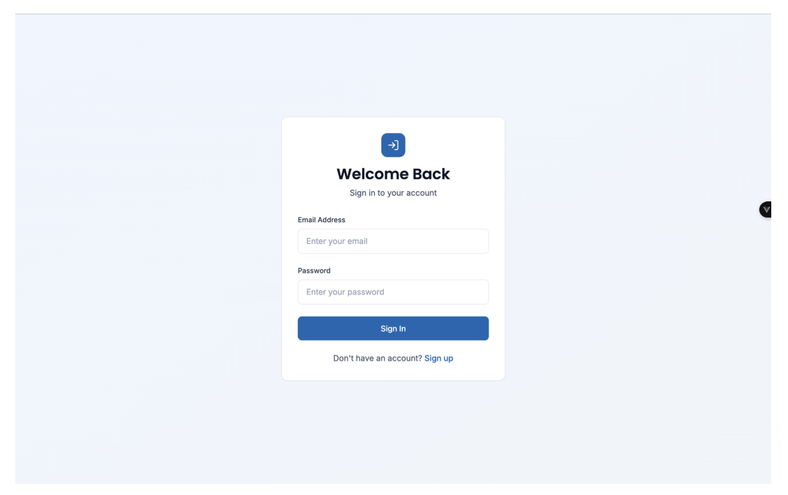
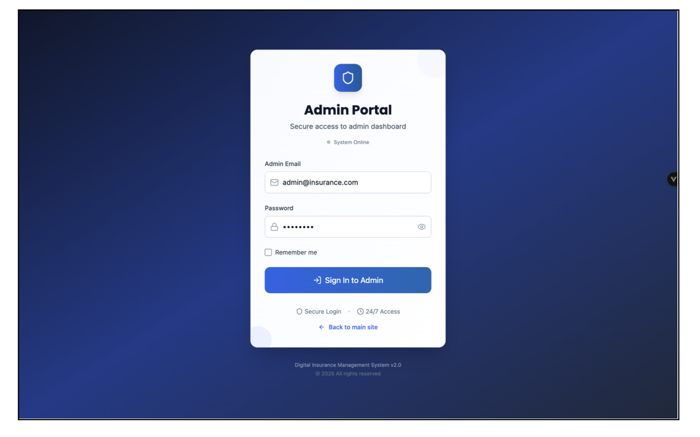

# Digital Insurance Management System

A modern, scalable platform for managing digital insurance operations using SpringBoot(JAVA), VueJS(JAVASCRIPT). This project uses Docker and PostgreSQL for easy setup.


## Features

- Policy lifecycle management (create, update, renew, cancel)
- Claims submission and processing workflows
- Customer, agent, and admin roles
- Notifications (triggers, bulk sends, read receipts)
- Support ticketing
- Dockerized local environment with a PostgreSQL database
- Migration-friendly database setup

## Tech Stack

Adjust the items below to match your exact implementation.

- Frontend:
  - Framework: Vue
  - UI: Tailwind CSS 
  - State & Data: Pinia
- Backend:
  - Framework: Java (Spring Boot)
  - Auth: JWT-based authentication
  - ORM/Database Toolkit: JPA/Hibernate
- Database:
  - PostgreSQL
  - Migrations: Flyway 
- DevOps:
  - Containers: Docker, Docker Compose
  - CI/CD: GitHub Actions 
- Testing:
  - Backend: JUnit

## About the Project

This repository is organized as a backend + frontend application orchestrated with Docker.

### Backend

The backend provides secure APIs for the core insurance domain, including policies, claims, customers, authentication/authorization, and administrative operations.

- Responsibilities:
 - Expose RESTful APIs for the frontend and integrations
  - Persist policy, claim, customer, and billing data in PostgreSQL
  - Handle authentication, authorization, and auditing
  - Manage data migrations and validations
  - Trigger and track notifications (bulk and individual)

- Key capabilities:
  - Policy CRUD, premium calculations, endorsements
  - Claims intake, status tracking, and settlement workflows
  - Role-based access control for customers/agents/admins

- Typical structure (may vary based on your framework):
  - backend/src: application code (controllers, services, models)
  - backend/migrations: database schema migrations

- Running:
  - With Docker Compose: see “Getting Started” below
  - Without Docker: Run using Intellij IDE

### Frontend

The frontend is a web portal for customers, agents, and admins to interact with the insurance system using VueJS.

- Responsibilities:
  - User-friendly UI for viewing and managing policies and claims
  - Authentication and secure access to user-specific data
  - Dashboards, reports, and notification center

- Key sections:
  - Customer dashboard (active policies, renewals, claims)
  - Claims center (new claim submission, status tracking)
  - Policy management (quotes, endorsements, payments)
  - Admin/Agent tools (approvals, underwriting views)
  - Notifications (reading, bulk operations) and Support tickets

- Typical structure (may vary based on your framework):
  - frontend/src: app UI, components, pages, routes, state
  - frontend/public: static assets

- Running:
  - npm run dev

## System Overview and Flows

Below are diagrams and UI flow images from the FunctionalImages directory. If your images are stored elsewhere, update the paths accordingly.

### Data Model


### Authentication


### Policy Management
- Create and manage policies

- Renew existing policies


### Claims
- Submit and track claims

- Approve/Reject claims (Agent/Admin)


### Notifications
- Trigger notifications on key events

- Send bulk notifications

- Mark notifications as read


### Support
- Create and manage support tickets


## Project Overview (Screens)

These screenshots provide a quick tour of core user and admin flows. If the ProjectOverview directory resides elsewhere, update the relative paths.

### User Screens
1. Login  


2. Register  


3. Dashboard  


4. Policies  


5. Claims  


6. Claim Submission  


7. Notifications  


### Admin Screens
1. Login  


2. Dashboard  


3. Policy Management  


4. Claims Management  


5. Support Tickets  


6. Send Notifications  


7. Send Notification by Policy  


## Getting Started

### 1) Build and Start Services

Build Docker images, start services, and run database migrations:

```bash
docker-compose --profile migrations up --build
```

This will:
- Build images for the application and database
- Start the backend, frontend, and PostgreSQL services (as defined in docker-compose.yml)
- Apply database migrations (if configured via the migrations profile)

### 2) Accessing the Database

Connect to the PostgreSQL instance running in Docker:

```bash
docker exec -it insurance-postgres psql -U postgres -d insurance_db
```

Adjust container name, user, and db name if they differ in your docker-compose.yml.

### 3) Stopping Services

Stop all running services:

```bash
docker-compose down
```

Stop services and remove volumes and orphan containers:

```bash
docker-compose down -v --remove-orphans
```

## Configuration

- Ensure docker-compose.yml references these env files or variables as needed.

## Directory Structure

```
.
├─ backend/          # Backend service code, migrations, configs
├─ frontend/         # Frontend application code and assets
├─ docker/
└─ README.md
```

## Contributing

Contributions are welcome! Feel free to open issues or submit pull requests for features, fixes, and improvements.

## License

This project is licensed under the terms described in the LICENSE file in this repository.
